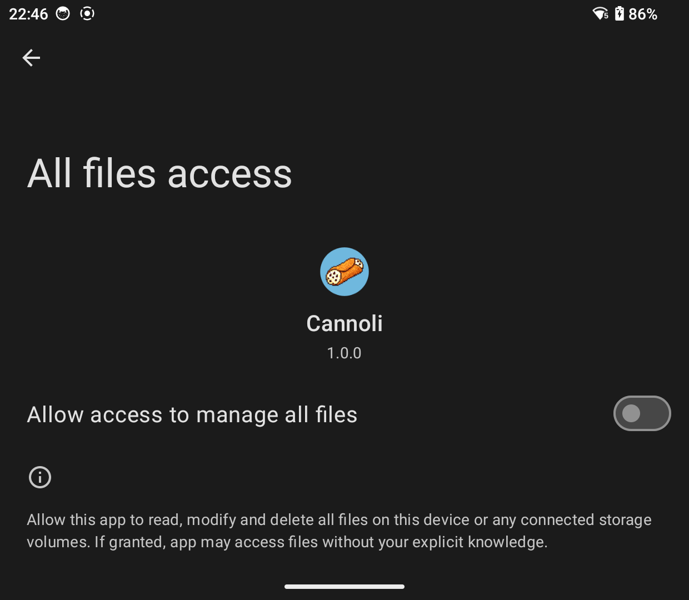
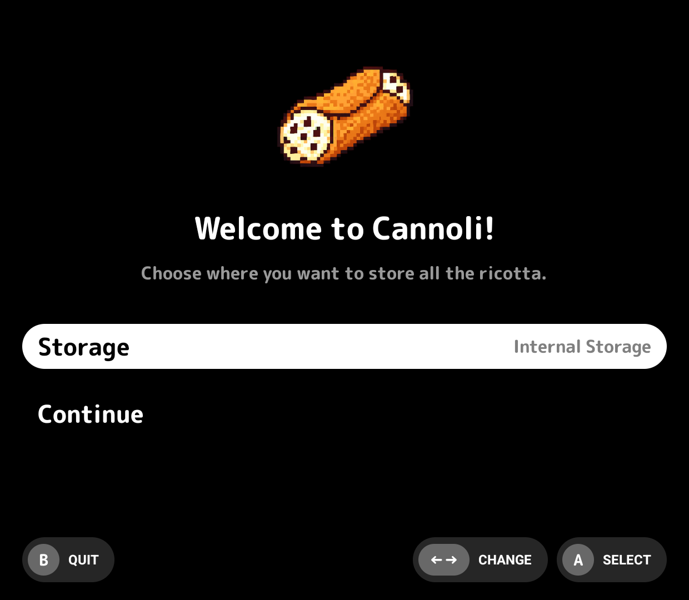
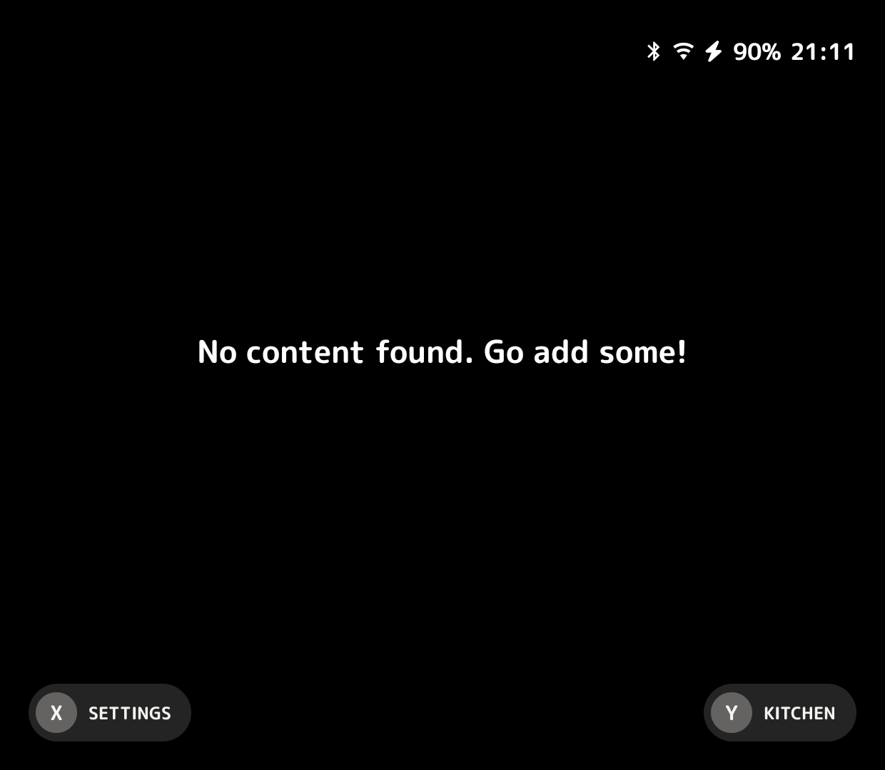

# Getting Started

> [!Important]
> **Android Version Compatibility ≥ 9**
>
> Cannoli is developed and tested on Android 11 and newer. 
>
> Users have reported it working on Android 9, but I have not confirmed this myself.

## Installing Cannoli

You can snag the latest APK from the [GitHub Releases](https://github.com/CannoliHQ/cannoli/releases/latest).

---

## First Launch

After installing you will have the Cannoli app.

On your first run you will be prompted for permission to manage all files.

Turn that on and hit the back arrow.

Once enabled you will have the simplest setup question to answer.

Do you want the Cannoli folder on internal storage, the SD Card (if present) or a custom location? Really that's it!

Make your choice and hit continue. 

Cannoli will then do some light housekeeping make sure everything is put into place.

---

## Loading Content

You will then land on a pretty barren main menu.

While you are free to add content however you'd like, the easiest way is with [Nonna's Kitchen](nonnas-kitchen.md), a built-in web client for uploading ROMs, box art, saves, and more from any browser on your network.

If you prefer to manage files manually, see the [Directory Structure](directory-structure.md) page for where everything goes.
