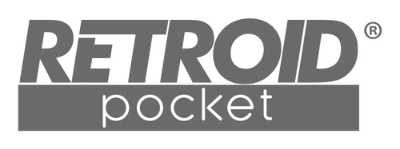

## Hardware Partners

Cannoli aims to support a wide variety of Android devices.

Buying devices for development is an activity that quickly becomes cost prohibitive for a hobby project.

I am extremely grateful for the following manufacturers who have provided developer units. I thank them for their support of the hobby and for their trust.

### Anbernic

{ .partner-logo }

RG Rotate

### AYN

{ .partner-logo }

Thor

### Retroid

{ .partner-logo }

Retroid Pocket Nova

