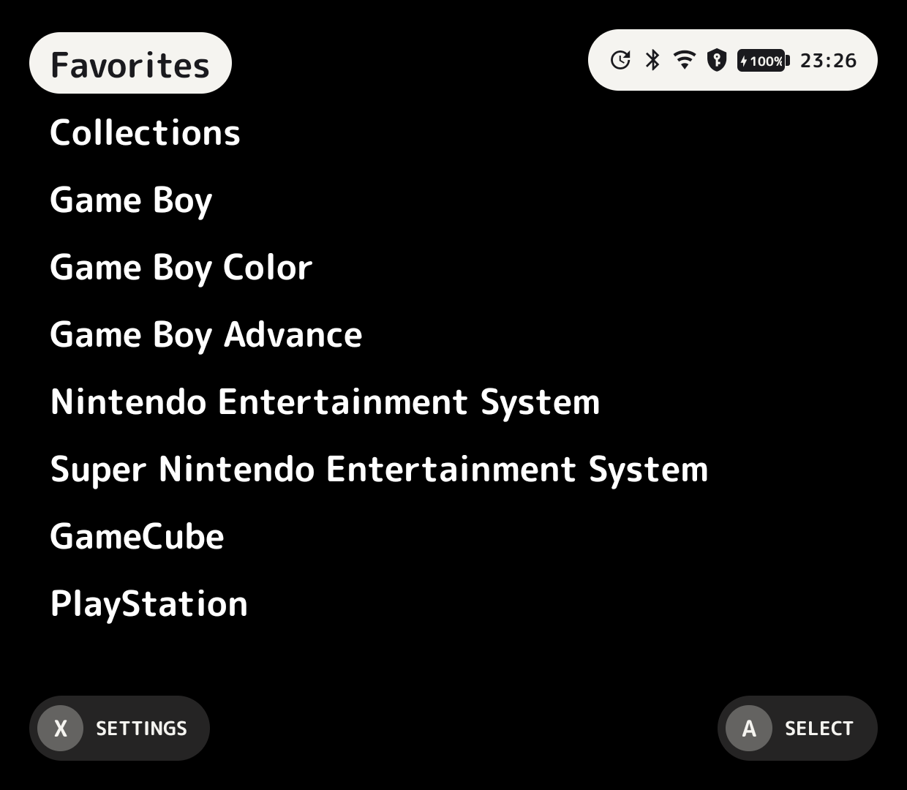
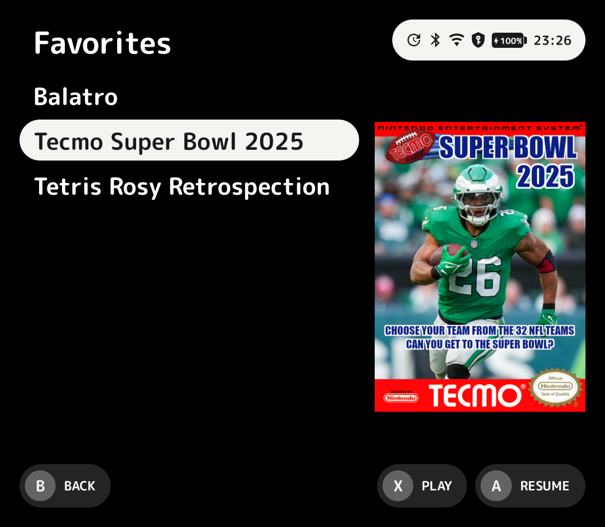
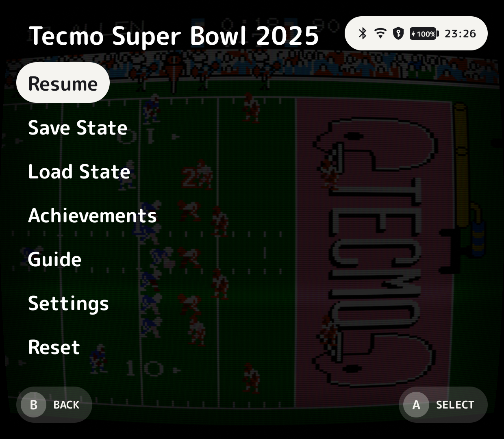

!!! warning
    Cannoli is still figuring out who it wants to be when it grows up.

    While the core vision of being a MinUI inspired launcher for Android won't change, menu structure, options, and features are in a state of flux.

    Things will settle down in the near future but for now expect experimentation and change as nothing is bolted down.
## What is Cannoli?

Cannoli is an opinionated setup for Retro Emulation on Android.

Android has a reputation for being tedious to set up. Cannoli looks to change this.

## What does it look like?

Cannoli, appearance-wise, is very minimal. At its core you get lists.

Nothing flashy here. No video previews and definitely no background music.

You do get a few personalization options: a wallpaper and accent colors.

It's barebones. Honestly, I don't want you in the menu. I want you playing games!

  
  
  

## What is Retro Emulation?

Retro Emulation, or just emulation, is achieved by using software called an emulator to mimic gaming hardware. It allows your Android device
to pretend to be a Game Boy, a SNES, a PlayStation, etc., and therefore lets you play games.

## The Inspiration

I absolutely adore [MinUI](https://github.com/shauninman/MinUI) by [Shaun Inman](https://github.com/shauninman).

No fuss, a focused feature set, and unapologetically opinionated.

I've been yearning for this type of experience on Android.

Without his masterpiece, this pale imitation would not exist.

For that, I thank him, and apologize for this bastardization of his creation.

## Avoid the rolling pin!

It has to be said. Nonna is too old for prison. And too gangster.

**Cannoli does not provide copyrighted materials or advise you on how to get them.**

If you ask for these anywhere (Discord, GitHub, etc.), say goodbye to your knuckles.

## Don't be a stranger!

Come hang out with the rest of the Holy Cannoli on [Discord](https://discord.gg/QKTjTQ796q)!