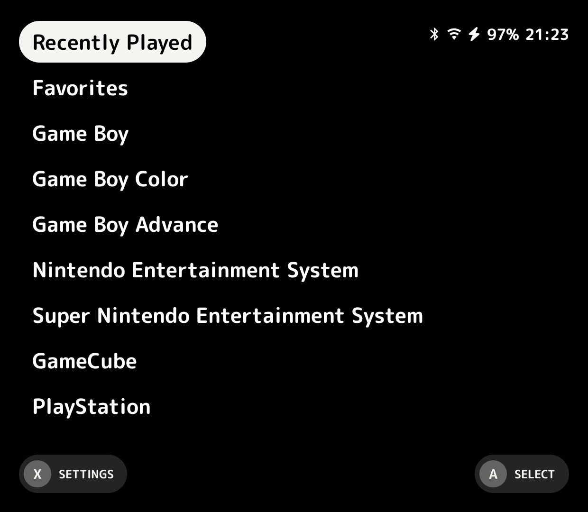
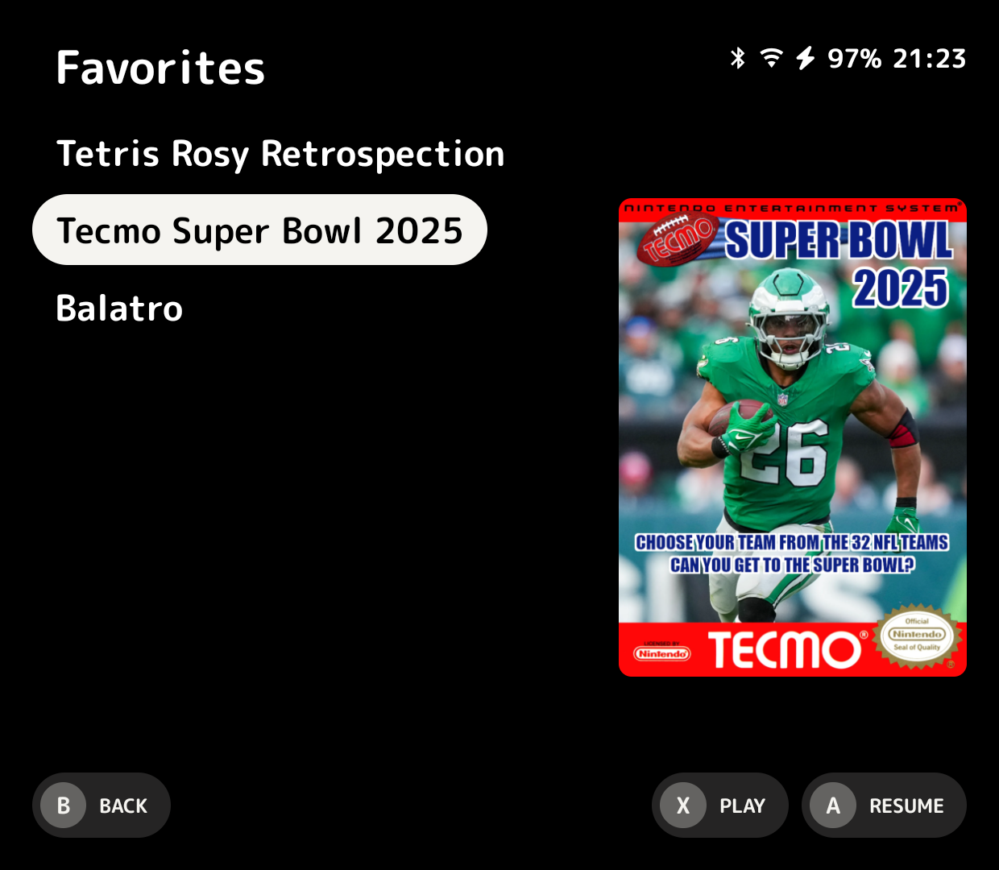
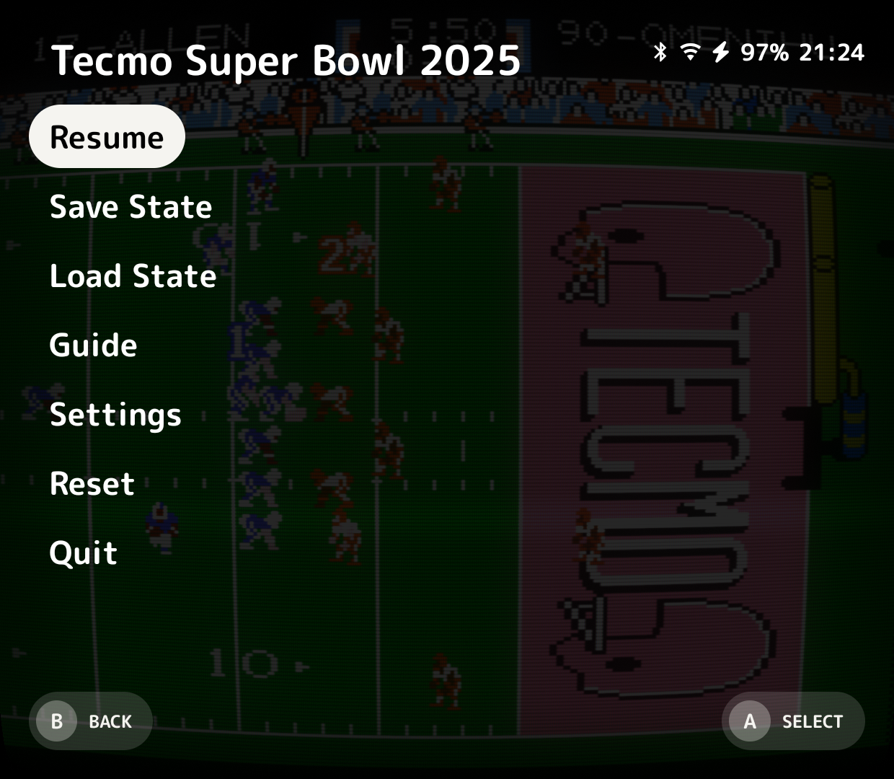

## What is Cannoli?

Cannoli is an opinionated setup for Retro Emulation on Android.

Android has a reputation for being tedious to set up. Cannoli looks to change this.

RetroArch is embedded directly inside Cannoli, with the Cannoli in-game menu (IGM) in place of RetroArch's quick menu. A set of cores ships with Cannoli with the ability to download more. All of your favorite RetroArch features are also present.

For more demanding systems, Cannoli can hand a game off to a standalone emulator.

Cannoli is not a frontend you can bolt onto an existing setup. It is a cohesive retro gaming environment that establishes a rigid [directory structure](directory-structure.md). Features you may come to expect in a frontend [won't be found here](#features-that-will-not-be-considered-or-implemented).

I am blunt about this out of respect for your time. If curating and tinkering are the fun part for you, Cannoli probably isn't your thing, and Android has other great options that are.

But if you would rather install one app, drop in your games and start playing, you are in exactly the right place.

---

## What is Retro Emulation?

Retro emulation is the process of using software called an emulator to mimic gaming hardware. This lets you play your old favorites on a much more modern phone, tablet, or dedicated handheld.

---

## What does it look like?

Cannoli is very minimal. There is nothing flashy here. At its core you get lists.

You do get a few personalization options: a wallpaper and accent colors.

That's intentional. I don't want you in the menu. I want you playing games!

  
  
  

---

## The Inspiration

I absolutely adore [MinUI](https://github.com/shauninman/MinUI) by [Shaun Inman](https://github.com/shauninman).

No fuss, a focused feature set, and unapologetically opinionated.

I've been yearning for this type of experience on Android.

Without his masterpiece, this pale imitation would not exist.

---

## Project Philosophy

Cannoli has five key design goals:

- Bake in the essentials
- Skip the tedious config
- Make adding games painless
- Eliminate distractions
- Get you to play some damn games!

### Features That Will Not Be Considered Or Implemented { data-toc-label="Rejected Features" }

- Art Scraper
- Game Switcher
- Game Time Tracker
- Menu Music
- Themes
- Video Previews
- Launching Cannoli Games From Other Frontends

### But I need that feature!

No you don't. And if you do, you have other amazing options on Android!

I won't yuck your yum; if curating and tinkering brings you joy, it brings me joy.

It just means Cannoli probably isn't for you, and that is totally okay.

---

## Avoid the rolling pin!

It has to be said. Nonna is too old for prison. And too gangster.

**Cannoli does not provide copyrighted materials or advise you on how to get them.**

If you ask for these anywhere (Discord, GitHub, etc.), say goodbye to your knuckles.

---

## Don't be a stranger!

Come hang out with the rest of the Holy Cannoli on [Discord](https://discord.gg/QKTjTQ796q)!
