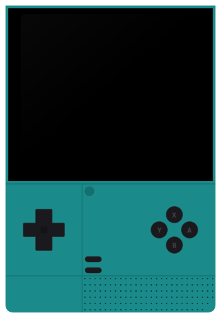

  

    
    <h1>cannoli_OS</h1>
    <h3>Sweet and Opinionated Retro Gaming on Android</h3>
    

      <a href="documentation/" class="md-button md-button--primary">Documentation</a>
      <a href="https://github.com/cannoliOS/scorza/releases/latest" class="md-button md-button--accent">Download</a>
    

  

  

    
    <video class="device-screen" autoplay loop muted playsinline>
      <source src="resources/img/homepage/demo.mp4" type="video/mp4">
    </video>
  

